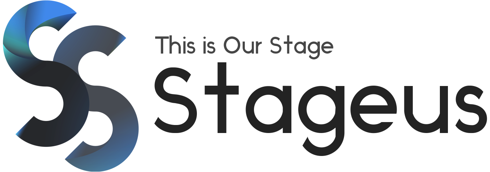

<!-- Markdown -->

<!-- Markup 언어 -->
<!-- 쓰는데로 표현해주는 ( 연산이 없는 언어 ) -->

<!-- 작성하는 내용을 html로 변경해줌 -->
<!-- 쉽게 html로 문서를 작성하게 해주는 언어 -->

스테이지어스 모의외주 프로젝트

웹 기초 과정

# 웹 기초 과정
## 웹 기초 과정
### 웹 기초 과정

**볼드체**

*이텔릭체*

~~취소선~~

[스테이지어스 홈페이지](https://stageus.co.kr)


```html
<div>
    <p>hello world
</div>
```
```c++
    int main() {
        return 0;
    }
``


<!-- # Stageus 홈페이지
### link : www.Stageus.co.kr
 -->